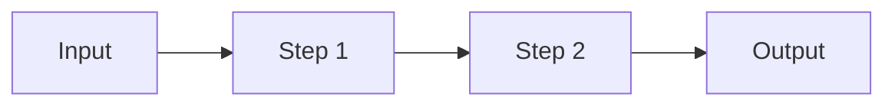

# PROJECT_NAME

> One-sentence pitch: what it does and for whom.


<!-- Add an eval-score badge once the nightly job publishes one. -->

<!-- DEMO: replace with a GIF (docs/demo.gif) or a live link. Keep it under 30 seconds. -->

## What it does (and doesn't)

- **Users:** who this is for.
- **Inputs:** what it accepts.
- **Outputs:** what it produces.
- **Out of scope:** what it deliberately does not do.
- **Data:** public / licensed / synthetic, and where it comes from.

## Results

Every claim below is backed by a reproducible run. `make eval-fast` writes its report to `evals/reports/` (git-ignored).

| Claim | Evidence | Result |
|-------|----------|--------|
| **Finds every encounter an independent oracle finds** | `make eval-fast`: 9 engineered SGP4 scenarios checked against a brute-force 1 s oracle, plus 3 named-encounter cases on the frozen default-scope snapshot ([ADR 0008](docs/adr/adr-0008-screening-evals-oracle-and-named-cases.md)) | 12/12 cases pass. Oracle recall 1.0 (359/359 encounters), miss error at most 0.1 m, TCA error at most 0.5 ms |
| Improvement over baseline | Baseline vs. current on same cases | _TBD_ |
| Handles failures gracefully | Reproducible timeout/error cases | _TBD_ |
| Cost and latency | Measured per run, p50/p95 | _TBD_ |
| **Screens a real scope end to end (default demo)** | `make screen` on the default scope, CelesTrak `iridium-NEXT` + `fengyun-1c-debris`. Pinned by the frozen-snapshot regression test (`tests/regression/`) | 1,995 objects, 509 conjunctions (0 high / 31 moderate / 478 low), ~5 s per 24 h window, 362 MB peak |
| Scales to an active-catalog scope (scale test, not the demo) | One-off `scripts/scaling_spike.py`, CelesTrak `active` + `fengyun-1c-debris`, frozen snapshot, median of 3 runs | 18,526 objects, ~140 s per 24 h window, 2.2 GB peak. See [Scale test](#scale-test-active-catalog-18526-objects) below |

The default demo scope is the documented example; the scale test is an extra data point about
performance at about 9x the object count. Timing figures in this section come from an Intel
i5-6267U with 8 GB RAM (see ADR 0007). The eval harness's own latency numbers come from whatever
machine runs it.

### Scale test: active catalog (18,526 objects)

A one-off measurement (session 2 Step B,
[ADR 0007](docs/adr/adr-0007-coarse-filter-not-required-for-full-catalog.md)). It used CelesTrak
`active` (16,620) + `fengyun-1c-debris` (1,968), fetched once on 2026-09-28 at 01:35Z and frozen.
18,526 objects were screened after dropping 61 stale element sets and 1 decayed object. The
window was 24 h at a 60 s step with a 5 km threshold. Times are medians of 3 fresh-process runs,
on an Intel i5-6267U with 8 GB RAM.

| | Default demo (1,995 objects) | Scale test (18,526 objects) |
|---|---|---|
| Propagation (SGP4) | 1.60 s | 17.98 s |
| Neighbor search (KD-tree build + query) | 1.94 s | 34.70 s |
| Post-search closest-approach math + SGP4 refinement | 1.24 s | 72.03 s |
| Pipeline total | 4.92 s | 139.75 s |
| Peak memory (`ru_maxrss`) | 362 MB | 2,214 MB |
| Candidate pairs per timestep (within the 485 km search radius) | 3,273 | 162,656 |
| Conjunctions flagged (high / moderate / low) | 509 (0 / 31 / 478) | 63,896 (2,299 / 8,605 / 52,992) |

Extrapolated (not measured) to the ~30k-object public catalog, screening time stays around 5
minutes per window. Memory, not time, becomes the constraint. Details are in ADR 0007.

#### What the 2,299 "high" results are, and aren't

**They are not 2,299 near-misses.** They're 2,299 predicted passes that meet the `high` row of a
threshold table (miss under 1 km, closing speed at least 1 km/s, an active payload involved). The
breakdown:

| Pair | High-tier results |
|---|---|
| Starlink vs. Starlink | 1,806 (78.6%) |
| Starlink vs. another payload | 401 |
| Starlink vs. debris or another constellation | 12 |
| **Involving at least one Starlink** | **2,219 (96.5%)** |
| No Starlink (other payloads, Kuiper, debris) | 80 |

This is expected, and it very likely reflects the risk logic correctly firing on real geometry,
not real collision risk:

- **A TLE snapshot can't see station-keeping or maneuvers.** Active constellations like Starlink
  continually adjust their orbits, including routine collision-avoidance maneuvers. SGP4
  extrapolates each element set as if the satellite will never thrust again, so two satellites
  whose operator is actively keeping them apart can look, in a raw snapshot, exactly like two
  satellites on a collision course.
- **The prediction error is as large as the threshold.** TLE/SGP4 position error for fresh LEO
  elements is roughly 1 km, and it grows with element age. The median predicted miss among these
  results is 0.68 km, inside that error. The tool can't tell a 0.3 km pass from a 1.3 km pass at
  this accuracy.
- **Dense shells produce many geometric crossings.** About 11,000 Starlink satellites share a
  handful of orbital shells, so many of them cross at similar altitudes each day. Operators screen
  these with their own precise ephemerides and planned maneuvers, not public TLEs.

This is the limitation [ADR 0004](docs/adr/adr-0004-risk-heuristic-not-probability-of-collision.md)
describes, a heuristic over public data rather than a probability of collision, made visible at
scale. Read `high` as "worth a closer look with better data", not "collision risk".

## Architecture

<!-- Request-flow diagram (Mermaid or image): input -> steps -> output. Name each LLM call and tool. -->



Every LLM call is wrapped in `app.llm.complete` (none exist yet - the screening pipeline logs its
steps via `app.tracing.span` directly, see `app.conjunction_pipeline`), tagged with its prompt
name and version, tokens, and cost. The whole `run()` call is metered by `app.llm.Budget` against
`Config.max_steps` / `max_cost_usd`; exceeding either raises `BudgetExceededError` rather than
truncating silently.

## Quickstart

Requires Python 3.11+ and [uv](https://docs.astral.sh/uv/).

```bash
git clone https://github.com/OWNER/REPO && cd REPO
cp .env.example .env        # add ANTHROPIC_API_KEY if you'll run anything live (see below)
make install
make test
make eval-fast               # screening evals on frozen data - free, no key required
```

### Mock vs. live

Every entry point (`make eval-fast`, and any script you add) defaults to `APP_LLM_MODE=mock`:
`app.llm.get_client` returns `app.mock_llm.MockAnthropicClient` instead of the real Anthropic
client, so nothing hits the network and nothing costs money. The mock auto-generates schema-valid
responses from whatever `output_config.format.schema` a request passes - real enough in *shape* to
exercise routing, tracing, and budget accounting, but it has no real-world knowledge: its output
values are generic placeholders, not reasoned about. **A passing mock run is a plumbing signal,
not a quality signal.**

Nothing in this project calls the API today: the screening pipeline makes no LLM calls, and
`make eval-fast-live` runs the same free suite as `make eval-fast`. `APP_LLM_MODE=live` only
matters if an LLM step is added later.

## Evaluation

`make eval-fast` runs the real pipeline on frozen inputs with the network blocked. It makes no LLM
calls, so it's free, and `make eval-fast-live` just runs the same suite. Details are in
[`evals/README.md`](evals/README.md) and the design is in
[ADR 0008](docs/adr/adr-0008-screening-evals-oracle-and-named-cases.md).

- **Known-answer cases:** small engineered catalogs (a crossing between samples, a sub-1 km
  hypervelocity pass, threshold and window edges, a slow crossing, a co-located twin, a stale
  element set, missing SATCAT, a 40-object crowd). Each checks risk levels and misses, and each is
  checked against a brute-force oracle: raw SGP4 on a 1 s grid, every pair, every sample.
- **Named-encounter cases:** specific, human-checked facts from the frozen default-scope snapshot
  (closest active-payload pass, co-located pair, stale drops).
- **Gates** in `evals/thresholds.yaml`: every case must pass (the pipeline is deterministic),
  p95 latency under 30 s.
- Cases, thresholds and fixtures change only in their own commits, never to make a failing eval
  pass.

## Known failures and limitations

<!-- Real failures only. For each: the input, what went wrong, how you investigated, status. -->

### No high-risk conjunction at the default demo scope

- **Input:** the default scope, CelesTrak `iridium-NEXT` + `fengyun-1c-debris` (about 2,000
  objects), over a 24 h window at a 60 s step with a 5 km screening threshold.
- **What happens:** the pipeline flags real close approaches, but none meets the `high` tier (miss
  under 1 km, closing speed at least 1 km/s, and at least one active payload involved). Run
  `20260928T0101Z-c6e1f2` flagged 509 encounters: 0 high, 31 moderate, 478 low. 52 involved an
  active Iridium satellite, and the closest of those was 1.29 km. Every sub-1 km pass (the closest
  was 0.11 km) was debris vs. debris, which the table caps at `moderate` by design.
- **What that means:** the default demo never shows a `high` result, so a reviewer running
  `make screen` won't see that tier.
- **Update 2026-09-28 (session 2 Step B):** the `high` tier does fire on real data at a larger
  scope. The one-off active-catalog scale test flagged 2,299 `high` results; 2,219 (96.5%)
  involve a Starlink satellite. That confirms the logic triggers on live inputs. It is **not**
  evidence of real collision risk: see
  [What the 2,299 "high" results are, and aren't](#what-the-2299-high-results-are-and-arent).
- **Status:** open for the default scope. It's a scope choice, not a code defect. Options: add a
  dense active constellation to the demo scope (at the cost of runtime), or keep the demo small
  and point to the Step B run as the live `high` example.

### Risk levels are a heuristic, not a probability of collision

Public GP/TLE data carries no covariance, so risk tiers come from a documented threshold table
([ADR 0004](docs/adr/adr-0004-risk-heuristic-not-probability-of-collision.md)), not a computed Pc.
Miss distances are screening estimates with roughly km-level error for fresh elements. This tool
does not replace or match CSpOC's operational conjunction assessments.

## Security and cost notes

- Every entry point defaults to `APP_LLM_MODE=mock` (zero cost, no key required). No code path
  calls the API today; see Mock vs. live above.
- Secrets are read from environment variables; nothing sensitive is committed.
- Untrusted inputs: describe how they're handled.
- Agent loops have step and cost caps (`src/app/config.py`) - both are guesses until validated
  against a real live run, see `evals/thresholds.yaml`'s comment.
- `Config.max_cost_usd` bounds one agent run, not a whole eval run's total spend.
  `evals/thresholds.yaml`'s `max_total_cost_usd` bounds that instead. Neither replaces a real
  spend limit set on the API account itself - set one there too.

## Design decisions

Short decision records live in [`docs/adr/`](docs/adr/). Cross-project lessons - patterns worth
porting into this template, gaps found while building a real project from it - live in
[`docs/lessons-learned.md`](docs/lessons-learned.md); check it before starting a new project from
this template, and add to it when you find the next gap.

## What's next

- One design decision I'd revisit:
- One unresolved limitation:
- Next planned test:
