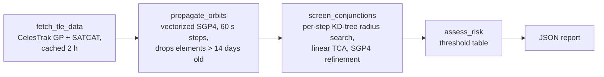

# Satellite Conjunction Screening

> Screens public satellite tracking data for close approaches between tracked objects over the
> next 24 hours, and rates each one with a documented, deliberately simple risk heuristic.


It fetches CelesTrak element sets, propagates every object with SGP4, finds every pair that comes
within 5 km, refines each pass's time and miss distance, and writes a JSON report. The core pipeline
makes no LLM or other paid API calls.

## Project boundary

**What it is.** A batch screener over public GP/TLE data. For a chosen scope (CelesTrak named
groups; the default since 2026-10-02 is CelesTrak's full published catalog: every active satellite
plus every debris-event group, about 19,000 objects. The original MVP demo scope, Iridium NEXT plus
the Fengyun-1C debris cloud in a shared ~780 km shell, is what the tests and evals pin), it reports every predicted pass under the screening threshold in the window, with time of
closest approach (TCA), miss distance, closing speed, both objects' identity, status and SATCAT
owner, and a risk level. The SATCAT owner (`satcat_owner`) is usually the registering state ("US",
"PRC"), not the operator: SATCAT has no operator field, so Iridium NEXT shows as "US" and there's no
code for SpaceX.

**What it is not.**

- **Not a probability of collision.** Real conjunction assessment computes a Pc from each object's
  position covariance. Public GP/TLE data carries no covariance, so this tool can't compute one.
  Risk levels come from a threshold table instead
  ([ADR 0004](docs/adr/adr-0004-risk-heuristic-not-probability-of-collision.md)).
- **Not operational-grade.** SGP4 position error for fresh LEO elements is roughly 1 km and grows
  with element age, so miss distances are screening estimates. A 0.3 km and a 1.3 km prediction
  can't be told apart at this accuracy.
- **Blind to maneuvers.** Each element set is propagated as if the object never thrusts again, so
  station-keeping constellations (Starlink especially) can look like they're on collision courses
  their operators are actively avoiding. See the
  [scale test](#what-the-2299-high-results-are-and-arent).
- **Not a replacement for CSpOC.** The U.S. Space Force's conjunction data messages (CDMs) on
  Space-Track are the authoritative product. This project deliberately builds its own pipeline
  rather than consuming that feed ([ADR 0001](docs/adr/adr-0001-data-source-and-build-own-screening.md)).
- **Not real-time.** One batch run a day (see [Daily run](#daily-run)), with no streaming ingestion,
  no alerting and no history: each run replaces the previous report.

**How risk levels are assigned.** First matching row wins. Thresholds live in
`config/screening.yaml` and their reasoning is in
[`docs/working-notes-and-decisions.md`](docs/working-notes-and-decisions.md).

| Level | Miss distance | Closing speed | Objects |
|---|---|---|---|
| `high` | under 1 km | at least 1 km/s | at least one active payload |
| `moderate` | under 1 km | any | any |
| `moderate` | under 2.5 km | any | at least one active payload |
| `low` | under the 5 km screening threshold | any | any |

An object with no SATCAT record counts as possibly active: a screening tool should err toward
surfacing a pass, not hiding it. Pairs moving slower than 0.1 km/s relative to each other (docked
vehicles, formation flyers) are reported separately as co-located and never rated. Read `high` as
"worth a closer look with better data", not "collision risk". Every report carries the same caveat
in its `limitations` field.

## Results

Every row is reproducible from the repo. Correctness comes from `make eval-fast`, which writes its
report to `evals/reports/` (git-ignored). The other two rows come from pipeline runs on frozen
CelesTrak snapshots.

| Claim | Evidence | Result |
|-------|----------|--------|
| **Finds every encounter an independent oracle finds** | `make eval-fast`: 9 engineered SGP4 scenarios checked against a brute-force 1 s oracle, plus 3 named-encounter cases on the frozen default-scope snapshot ([ADR 0008](docs/adr/adr-0008-screening-evals-oracle-and-named-cases.md)) | 12/12 cases pass. Oracle recall 1.0 (359/359 encounters), miss error at most 0.1 m, TCA error at most 0.5 ms |
| **Screens a real scope end to end (default demo)** | `make screen` on the default scope, CelesTrak `iridium-NEXT` + `fengyun-1c-debris`. Pinned by the frozen-snapshot regression test (`tests/regression/`) | 1,995 objects, 509 conjunctions (0 high / 31 moderate / 478 low), ~5 s per 24 h window, 362 MB peak |
| Scales to an active-catalog scope (scale test, not the demo) | One-off `scripts/scaling_spike.py`, CelesTrak `active` + `fengyun-1c-debris`, frozen snapshot, median of 3 runs | 18,526 objects, ~140 s per 24 h window, 2.2 GB peak. See [Scale test](#scale-test-active-catalog-18526-objects) below |

**Cost:** $0 per run. No LLM or paid API calls anywhere in the pipeline.

The default demo scope is the documented example; the scale test is an extra data point about
performance at about 9x the object count. Timing figures in this section come from an Intel
i5-6267U with 8 GB RAM (see ADR 0007). The eval harness's own latency numbers come from whatever
machine runs it.

## Quickstart

Requires Python 3.11+ and [uv](https://docs.astral.sh/uv/). No account or API key is needed.

```bash
git clone https://github.com/maxnorris01-bot/satellite-conjunction-screening
cd satellite-conjunction-screening
make install
make screen          # live CelesTrak data, full catalog (~19k objects), 24 h window from now
```

At the full-catalog default, `make screen` takes about 35 s and peaks near 2.9 GB on an Apple M5,
and writes a ~78 MB report (ADR 0010). For a quick look, run the MVP demo scope instead:
`make screen ARGS="--groups iridium-NEXT fengyun-1c-debris"`.

A real run at that MVP demo scope (2026-10-01, live CelesTrak data; one `WARNING` line per dropped
stale element set omitted):

```text
$ make screen
report: runs/reports/20261001T0222Z-f4a843.json
objects screened: 2010 (fetched 2060, dropped 50)
conjunctions flagged: 515 {'high': 1, 'moderate': 31, 'low': 483}
co-located pairs (not rated): 3
timings (s): fetch_tle_data=4.2233, propagate_orbits=0.4334, screen_conjunctions=0.8813, assess_risk=0.0003, write_report=0.0039, total=5.5429
```

Numbers change with every run: the catalog updates every few hours and the window starts at the
current minute. The report lands in `runs/reports/<run_id>.json`. Each conjunction record looks like this one, a real pass from the frozen default-scope snapshot
(`object_a` trimmed):

```json
{
  "risk_level": "moderate",
  "risk_reason": "miss < 2.5 km with an active payload involved",
  "tca_utc": "2026-09-28T09:44:38.004788Z",
  "miss_distance_km": 1.2889,
  "relative_speed_km_s": 14.425,
  "object_a": { "norad_id": 31471, "name": "FENGYUN 1C DEB", "object_type": "DEB", "...": "..." },
  "object_b": {
    "norad_id": 42806,
    "name": "IRIDIUM 115",
    "international_designator": "2017-039D",
    "object_type": "PAY",
    "ops_status": "+",
    "active_payload": true,
    "satcat_owner": { "code": "US", "name": "United States" },
    "element_epoch_utc": "2026-09-27T05:49:46.169472Z",
    "element_age_at_tca_days": 1.163
  },
  "screening": {
    "linear_estimate_miss_km": 1.2894,
    "linear_estimate_tca_utc": "2026-09-28T09:44:38.000861Z"
  }
}
```

The report also records its window, every parameter used, dropped objects (with reasons),
co-located pairs and screening diagnostics. `schema_version` changes only on breaking changes.

**Other scopes and windows.** Flags override `config/screening.yaml` for one run:

```bash
make screen ARGS="--groups stations --window-hours 48"
make screen ARGS="--threshold-km 10 --step-seconds 30"
```

CelesTrak responses are cached in `cache/` for 2 hours, matching CelesTrak's update cadence and
fair-use policy, so re-running within that window makes no network requests.

**Checks** (all offline, no network):

```bash
make test            # unit tests + frozen-snapshot parity regression
make eval-fast       # screening evals: oracle-checked scenarios + named encounters
make lint typecheck
```

## How it works



- **Fetch** (`app.data`): GP elements as OMM JSON (catalog numbers above 99999 don't fit TLE
  lines) plus SATCAT object type and status, both from CelesTrak with no account.
- **Propagate** (`app.propagation`): `sgp4`'s vectorized C++ propagator, in the TEME frame (pair
  separations don't depend on the frame). [ADR 0002](docs/adr/adr-0002-sgp4-library-choice.md).
- **Screen** (`app.screening`): LEO closing speeds reach ~15 km/s, so at a 60 s step a 5 km pass
  almost always falls between samples. Each step therefore keeps pairs within
  `threshold + max_closing_speed x step / 2` (485 km) via a KD-tree, estimates the straight-line
  closest approach in the half-step around the sample, and refines every candidate with SGP4.
  [ADR 0003](docs/adr/adr-0003-screening-algorithm-coarse-fine-filter.md),
  [ADR 0006](docs/adr/adr-0006-between-sample-closest-approach-detection.md).
- **Assess and report** (`app.risk`, `app.reporting`): the threshold table above, then one JSON
  file per run.

Every step runs inside an `app.tracing.span`, which appends a JSON line (duration, counts, peak
memory, run id) to `runs/trace.jsonl`.

## Daily run

A GitHub Actions workflow ([`daily-run.yml`](.github/workflows/daily-run.yml)) starts a Fly.io
Machine once a day at 10:17 UTC, and the Machine runs `python -m app.publish`. The workflow also
verifies the run: it fails if the Machine's exit code isn't 0, or if the bucket's
`history/index.json` wasn't rewritten by this run. A red run is the alert. Fly's own built-in
schedule was retired because it skipped days
([ADR 0012](docs/adr/adr-0012-daily-run-triggered-by-github-actions.md)). Each run screens the full-catalog scope (about 19,000
objects) with fresh CelesTrak data and overwrites these objects in a public Tigris bucket:

| Object | Contents |
|---|---|
| `reports/current.json` | The report, same format as `make screen`'s (~78 MB at full-catalog scope) |
| `objects/<date>.json.gz`, `reports/<date>.json.gz` | Dated copies of the two above for the globe's time slider, gzipped (`Content-Encoding: gzip`; report ~5.3 MB compressed). Kept for 7 days, pruned every run ([ADR 0011](docs/adr/adr-0011-dated-snapshot-retention.md)) |
| `history/index.json` | Which dates have both a dated objects and a dated report key, newest first |
| `objects/current.json` | Every screened object, flat and propagation-ready: `norad_id`, `name`, TLE lines, epoch, `satcat_owner`, `object_type`, `active_payload`, `source_groups` ([ADR 0010](docs/adr/adr-0010-portfolio-api-and-full-catalog-scope.md)). Served gzipped (`Content-Encoding: gzip`, ~1.4 MB) |
| `snapshots/current/{gp,satcat}-<group>.json.gz` | The exact CelesTrak responses behind it, in the regression test's snapshot format |
| `snapshots/current/manifest.json` | The run id and snapshot file list, to check against the report's `run_id` |

The `current.json` keys always hold the latest run. History is only the dated keys: one per UTC
date (a second run that day overwrites it), deleted once more than 7 days older than the latest
run's date. A failed run uploads nothing, so the previous report stays, and the failure shows in
`fly logs` as one JSON line. If only the retention step fails, the run still publishes and logs a
`retention_error`. Design and tradeoffs: [ADR 0009](docs/adr/adr-0009-daily-run-on-fly-scheduled-machine.md)
and [ADR 0011](docs/adr/adr-0011-dated-snapshot-retention.md).

**Dry run locally** (same objects, written to `runs/publish/`, reusing the 2-hour cache):

```bash
make publish-local
```

**One-time Fly setup** (needs `flyctl` and `fly auth login`):

```bash
fly apps create satellite-conjunction-screening
fly storage create -a satellite-conjunction-screening -n satellite-conjunction-screening --public
make fly-build                 # remote build, pushes registry.fly.io/satellite-conjunction-screening:<commit>
make fly-machine-create        # Machine: no restart, shared-cpu-4x 8 GB, sjc; runs once now
fly logs -a satellite-conjunction-screening
fly tokens create deploy -a satellite-conjunction-screening   # then: gh secret set FLY_API_TOKEN
```

The daily trigger needs that token stored as the `FLY_API_TOKEN` Actions secret (paste it at the
`gh secret set` prompt; never into a file or chat). Run the workflow by hand from the Actions tab,
or with `gh workflow run daily-run.yml`. It refuses to start within 2 hours of the last publish,
because CelesTrak allows one download per group per update and a repeat gets HTTP 403.

`fly storage create` sets `BUCKET_NAME` and the S3 credentials as app secrets. With a public
bucket, the report is served at `https://<bucket>.fly.storage.tigris.dev/reports/current.json`
(confirmed 2026-10-01; the raw CelesTrak snapshot is at `snapshots/current/manifest.json` and
`snapshots/current/*.json.gz`). **After code changes:** `make fly-build`, then
`make fly-update FLY_MACHINE_ID=<id>` (`fly machine list` shows the id). The update doesn't start a
stopped Machine, so dispatch the workflow (or `fly machine start <id>`) to publish immediately
rather than waiting for the next daily run. Right after a build, the update can fail with `MANIFEST_UNKNOWN` while the registry
catches up; retrying a few seconds later works.

## Evaluation

`make eval-fast` runs the real pipeline on frozen inputs with the network blocked. Details are in
[`evals/README.md`](evals/README.md) and the design is in
[ADR 0008](docs/adr/adr-0008-screening-evals-oracle-and-named-cases.md).

- **Known-answer cases:** small engineered catalogs (a crossing between samples, a sub-1 km
  hypervelocity pass, threshold and window edges, a slow crossing, a co-located twin, a stale
  element set, missing SATCAT, a 40-object crowd). Each checks risk levels and misses, and each is
  checked against a brute-force oracle: raw SGP4 on a 1 s grid, every pair, every sample.
- **Named-encounter cases:** specific, human-checked facts from the frozen default-scope snapshot
  (closest active-payload pass, co-located pair, stale drops).
- **Parity regression** (`tests/regression/`, part of `make test`): the full default-scope output on
  a frozen snapshot must not change at all. It's the gate for pure speedups.
- **Gates** in `evals/thresholds.yaml`: every case must pass (the pipeline is deterministic),
  p95 latency under 30 s. Cases, thresholds and fixtures change only in their own commits.

## Scale test: active catalog (18,526 objects)

A one-off measurement (session 2 Step B,
[ADR 0007](docs/adr/adr-0007-coarse-filter-not-required-for-full-catalog.md)). It used CelesTrak
`active` (16,620) + `fengyun-1c-debris` (1,968), fetched once on 2026-09-28 at 01:35Z and frozen.
18,526 objects were screened after dropping 61 stale element sets and 1 decayed object. The
window was 24 h at a 60 s step with a 5 km threshold. Times are medians of 3 fresh-process runs,
on an Intel i5-6267U with 8 GB RAM.

| | Default demo (1,995 objects) | Scale test (18,526 objects) |
|---|---|---|
| Propagation (SGP4) | 1.60 s | 17.98 s |
| Neighbor search (KD-tree build + query) | 1.94 s | 34.70 s |
| Post-search closest-approach math + SGP4 refinement | 1.24 s | 72.03 s |
| Pipeline total | 4.92 s | 139.75 s |
| Peak memory (`ru_maxrss`) | 362 MB | 2,214 MB |
| Candidate pairs per timestep (within the 485 km search radius) | 3,273 | 162,656 |
| Conjunctions flagged (high / moderate / low) | 509 (0 / 31 / 478) | 63,896 (2,299 / 8,605 / 52,992) |

Extrapolated (not measured) to the ~30k-object public catalog, screening time stays around 5
minutes per window. Memory, not time, becomes the constraint. Details are in ADR 0007.

### What the 2,299 "high" results are, and aren't

**They are not 2,299 near-misses.** They're 2,299 predicted passes that meet the `high` row of a
threshold table (miss under 1 km, closing speed at least 1 km/s, an active payload involved). The
breakdown:

| Pair | High-tier results |
|---|---|
| Starlink vs. Starlink | 1,806 (78.6%) |
| Starlink vs. another payload | 401 |
| Starlink vs. debris or another constellation | 12 |
| **Involving at least one Starlink** | **2,219 (96.5%)** |
| No Starlink (other payloads, Kuiper, debris) | 80 |

This is expected, and it very likely reflects the risk logic correctly firing on real geometry,
not real collision risk:

- **A TLE snapshot can't see station-keeping or maneuvers.** Active constellations like Starlink
  continually adjust their orbits, including routine collision-avoidance maneuvers. SGP4
  extrapolates each element set as if the satellite will never thrust again, so two satellites
  whose operator is actively keeping them apart can look, in a raw snapshot, exactly like two
  satellites on a collision course.
- **The prediction error is as large as the threshold.** TLE/SGP4 position error for fresh LEO
  elements is roughly 1 km, and it grows with element age. The median predicted miss among these
  results is 0.68 km, inside that error. The tool can't tell a 0.3 km pass from a 1.3 km pass at
  this accuracy.
- **Dense shells produce many geometric crossings.** About 11,000 Starlink satellites share a
  handful of orbital shells, so many of them cross at similar altitudes each day. Operators screen
  these with their own precise ephemerides and planned maneuvers, not public TLEs.

This is the limitation [ADR 0004](docs/adr/adr-0004-risk-heuristic-not-probability-of-collision.md)
describes, a heuristic over public data rather than a probability of collision, made visible at
scale. Read `high` as "worth a closer look with better data", not "collision risk".

## Known failures and limitations

### `high` results are rare at the default demo scope

- **Input:** the default scope, CelesTrak `iridium-NEXT` + `fengyun-1c-debris` (about 2,000
  objects), over a 24 h window at a 60 s step with a 5 km screening threshold.
- **What happens:** the pipeline flags real close approaches, but none meets the `high` tier (miss
  under 1 km, closing speed at least 1 km/s, and at least one active payload involved). Run
  `20260928T0101Z-c6e1f2` flagged 509 encounters: 0 high, 31 moderate, 478 low. 52 involved an
  active Iridium satellite, and the closest of those was 1.29 km. Every sub-1 km pass (the closest
  was 0.11 km) was debris vs. debris, which the table caps at `moderate` by design.
- **What that means:** the default demo never shows a `high` result, so a reviewer running
  `make screen` won't see that tier.
- **Update 2026-09-28 (session 2 Step B):** the `high` tier does fire on real data at a larger
  scope. The one-off active-catalog scale test flagged 2,299 `high` results; 2,219 (96.5%)
  involve a Starlink satellite. That confirms the logic triggers on live inputs. It is **not**
  evidence of real collision risk: see
  [What the 2,299 "high" results are, and aren't](#what-the-2299-high-results-are-and-arent).
- **Update 2026-10-01:** the first live `high` at the default scope. Run `20261001T0222Z-f4a843`
  (window from 2026-10-01T02:22Z) flagged IRIDIUM 105 (NORAD 41921, active) vs. a Fengyun-1C
  fragment (NORAD 30413): 0.57 km at 11.8 km/s, TCA 2026-10-01T22:56:33Z, both element sets about
  1.5 days old. The same caveats apply as for any `high` here: it's a threshold-table result inside
  the ~1 km prediction error, not a collision warning.
- **Status:** mostly resolved. The default scope can produce a `high`, but whether a given run does
  depends on the window, so a reviewer may still see none. The frozen snapshot behind the tests and
  the Results table (window 2026-09-28T01:01Z) still has 0 high, and the synthetic
  `high-tier-hypervelocity` eval case exercises the tier on every run.

### Risk levels are a heuristic, not a probability of collision

By design, not a defect: see [Project boundary](#project-boundary).

## Security and cost notes

- No secrets are needed locally: CelesTrak requires no account. The daily run's bucket credentials
  exist only as Fly app secrets, set by `fly storage create`. `.env.example` lists the template's
  optional settings; nothing sensitive is committed.
- The bucket is public on purpose: it holds only the report and CelesTrak data that's already
  public. The Machine's credentials can write to it; nothing else can.
- Inputs from CelesTrak are validated: records missing required fields are skipped and recorded,
  and a non-JSON response (for example, a mistyped group name) raises `CelesTrakError`.
- Requests are cached and rate-limited by design (at most one per group every 2 hours).
- The repo inherits an LLM client (`app.llm`, `app.mock_llm`, mock mode by default) from its
  template. Nothing calls it today; it's there for a possible later summary step.

## Design decisions

Decision records live in [`docs/adr/`](docs/adr/):

| ADR | Decision |
|---|---|
| [0001](docs/adr/adr-0001-data-source-and-build-own-screening.md) | CelesTrak as the source; build the screening pipeline rather than consume Space-Track CDMs |
| [0002](docs/adr/adr-0002-sgp4-library-choice.md) | `sgp4` directly (vectorized `SatrecArray`) rather than `skyfield` |
| [0003](docs/adr/adr-0003-screening-algorithm-coarse-fine-filter.md) | Coarse filter plus per-timestep KD-tree fine filter (KD-tree shipped) |
| [0004](docs/adr/adr-0004-risk-heuristic-not-probability-of-collision.md) | Risk is a documented heuristic, not a Pc |
| [0005](docs/adr/adr-0005-deployment-sequencing.md) | Deployment deferred until runtime and memory are measured (superseded by 0009) |
| [0006](docs/adr/adr-0006-between-sample-closest-approach-detection.md) | Between-sample closest-approach detection and the co-located split |
| [0007](docs/adr/adr-0007-coarse-filter-not-required-for-full-catalog.md) | The coarse filter isn't needed for full-catalog runtime; memory is the next limit |
| [0008](docs/adr/adr-0008-screening-evals-oracle-and-named-cases.md) | Evals: oracle-checked synthetic scenarios plus named real-data encounters |
| [0009](docs/adr/adr-0009-daily-run-on-fly-scheduled-machine.md) | Daily run on a Fly.io scheduled Machine, publishing to a public Tigris bucket (supersedes 0005) |

The running decisions log is [`docs/working-notes-and-decisions.md`](docs/working-notes-and-decisions.md),
and per-session write-ups are in [`docs/sessions/`](docs/sessions/).

## What's next

Priorities are in [`docs/todo.md`](docs/todo.md). The current phase finishes the tracker polish and
then builds only the foundation a later visualization product would need. The daily run is in
place (above), and each object carries its SATCAT owner. Still to come:

1. **A small API** serving the current report and recent history. This is the gate: if it comes
   easily, the visualization ideas (3D globe, owner filtering, sky view) stay on the table; if it's
   a significant lift, the project closes out there.

There's no standalone dashboard planned: the JSON report is consumed programmatically, and the API
will serve it.

- **A decision I'd revisit:** the default demo scope. It puts active payloads and debris in the same
  shell, but a `high` result appears only in some windows (see Known failures).
- **An unresolved limitation:** no covariance and no maneuver knowledge, so risk stays a heuristic.
  A real Pc would need covariance from somewhere, such as Space-Track CDMs used as a comparison
  set, which would be its own ADR.
- **The next correctness check:** compare a few flagged encounters against CelesTrak SOCRATES for
  the same window.
